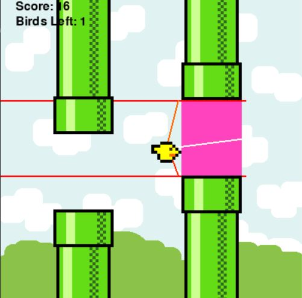

# Flappy AI

Although being a relatively simple game, Flappy Bird was an extremely addicting game and we constantly were trying to beat our highscore. I myself, wasn't really good at it, so in my journey in learning AI I wanted to make a model that could learn how to play the game and get a massive high score.

This AI works using the NEAT algorithm. The algorithm works by taking a population and establishing a goal. As generations pass, our birds (and the neural networks that control movement) get better at accomplishing set goals by mutating and evolving. This happens in the sense that every time a bird does something right or accomplishes certain objective he's given a reward. So the evolution happens when you take birds that have been rewarded and make another bird combining the knowledge of the other two birds.

The algorithm works a lot like natural selection, but if you wish to read more about it, you can click [here](https://en.wikipedia.org/wiki/Neuroevolution_of_augmenting_topologies)

## How to play

For this to play, it is a simple as locating yourself in this folder (*FlappyAI*) and running this command.

```powershell
python main.py
```

*Note: This version of the game lacks all the main menu and records menu of the normal flappy game.*

## Visualization

For the AI to work we got to establish what it can see. I've set this to be:

- The distance between the bird and the next pipe.
- The distance between the bird and the upper part of the pipe.
- The distance between the bird and the lower part of the pipe.

Visually it looks something like this:



With this every time the bird goes through a pipe it's given a reward, and before you know it we have an invincible AI that is capable of scoring over 500 points.

