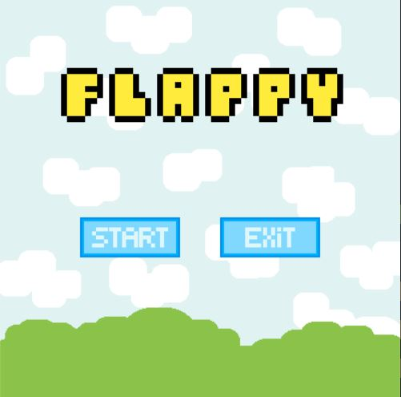
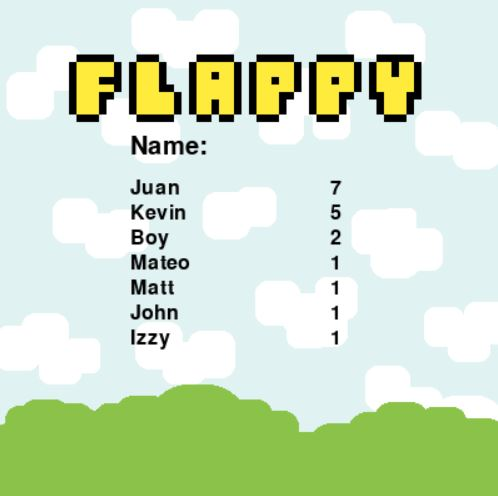

# Normal Flappy

## How to play

When you first launch the game you will be greeted with this screen. 

Here you can choose to play by pressing "Start" or exit the game by pressing "Exit". *Note: you can also exit the game at any time by pressing the **ESC** key.*

By starting the game you will be presented with this screen.

Once the game starts the objective of the game is to go through as many green pipes as you can without hitting them. This green pipes have a space between them that you can safely pass through.

By default the bird will fall, but you can control your height by pressing the **spacebar** to make you bird flap upwards.

If you where to hit a pipe, the celling or the floor you will lose. When this happens you will be taken to the high scores tab.

Here you can type your name and if you are in the top ten players with the best score, your name and record will be shown every time you get to this screen.

Once you have typed your name, press ***enter*** and you will be taken to the Main Menu.

